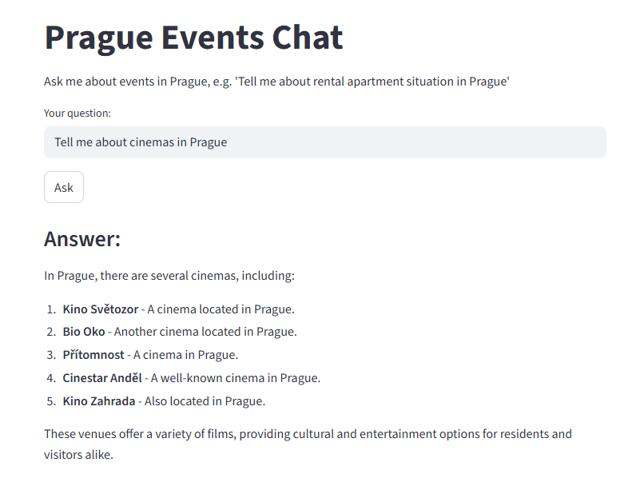

# Prague Events Chat
<div align="center">
   
</div>

## Project Description
The Prague Events Chat is an interactive application designed to help users explore and learn about events in Prague. The project combines a knowledge base (Qdrant vector database) and a large language model (LLM) (OpenAI's GPT) to provide accurate and context-aware answers to user queries. By leveraging automated ingestion pipelines, advanced retrieval techniques, and a user-friendly interface, the application ensures a seamless experience for users seeking information about Prague's vibrant cultural and social scene.

## Problem Description
The project addresses the challenge of efficiently retrieving and presenting information about events in Prague. Users often struggle to find relevant and up-to-date information about local news and events, especially when the data is scattered across multiple sources. This application solves the problem by:

- Ingesting and organizing event-related data into a structured knowledge base.
- Using a combination of vector search and LLMs to retrieve and summarize relevant information.
- Providing a conversational interface for users to ask questions and receive detailed answers.

## Retrieval Flow 
The retrieval flow integrates both a knowledge base (Qdrant) and an LLM (OpenAI GPT). The process involves:

Embedding user queries using OpenAI's text-embedding-ada-002 model.
Searching the Qdrant vector database for the most relevant paragraphs.
Passing the retrieved context to the LLM to generate a final, context-aware response.

## Retrieval Evaluation
The project evaluates a single retrieval approach using Qdrant's vector search capabilities. While multiple retrieval approaches (e.g., hybrid search) are not implemented, the current approach is optimized for the dataset.

## LLM Evaluation
The project uses a single prompt structure to interact with the LLM. While the prompt is well-designed, multiple prompt approaches have not been evaluated.

## Interface
The application features a Streamlit-based user interface, allowing users to interact with the system through a web application. Users can input questions, view answers, and explore Prague events in a conversational manner.

## Ingestion Pipeline
The ingestion pipeline is fully automated using a Python scripts:
- [`web_scraping.py`](https://github.com/NotYetBenGan/LLMZoomCamp/blob/main/Project/scripts/web_scraping.py):
    - Scrapes blog articles from a [Prague news website](https://www.vinegret.cz/646868/afisha-1) in Russian
    - Extracts their content and metadata
    - Translates the content from Russian to English via `gpt-3.5-turbo` model
    - Saves the results into [`JSON`](https://github.com/NotYetBenGan/LLMZoomCamp/tree/main/Project/data/vinegret_articles/json) 

- [`ingest_vinegret_to_qdrant.py`](https://github.com/NotYetBenGan/LLMZoomCamp/blob/main/Project/scripts/ingest_vinegret_to_qdrant.py):
    - Reads event data from [`JSON`](https://github.com/NotYetBenGan/LLMZoomCamp/tree/main/Project/data/vinegret_articles/json)
    - Filters and processes paragraphs
    - Embeds the data using `text-embedding-ada-002` embedding model
        - size = 1536
        - distance = models.Distance.COSINE
    - Stores the data in the Qdrant vector database collection `prague_events`

- [`retrieve_and_answer.py`](https://github.com/NotYetBenGan/LLMZoomCamp/blob/main/Project/scripts/retrieve_and_answer.py):
    - Retrieves relevant information from a Qdrant vector database
        - Qdrant vector database running at http://qdrant:6333
    - Formats the `CONTEXT` and the user’s `QUESTION` into a structured prompt
    - Sends the prompt to `gpt-4o` model
    - Generates a context-aware answer to a user-provided question 

## Monitoring
The project does not currently include monitoring features such as user feedback collection or a dashboard. I have plans to apply it after diving deeper in this topic

## Containerization 
The entire project is containerized using Docker Compose. Both the Qdrant service and the Streamlit app are included in the docker-compose.yml file, ensuring easy deployment and reproducibility.

## Reproducibility
The project includes clear and detailed instructions for running the application:

* The README.md provides step-by-step instructions for setting up the environment, starting the services, and exploring the app
* The dataset is included in the repository, and all dependencies are specified in requirements.txt

## Step-by-step instruction:
1. Prerequisites
    - Ensure Docker and Docker Compose are installed on the system.
    - Clone the project repository:
```
git clone https://github.com/NotYetBenGan/LLMZoomCamp.git
cd ./Project
```
2. Set your OPENAI_API_KEY environment variable in .env_example file and rename it to .env

3. Start Qdrant and the Streamlit app Docker containers
```
docker-compose up --build
```

4. Verify the Qdrant Collection
    - The Qdrant collection prague_events should already contain the ingested data.
    - To verify, you can query the Qdrant collection using the retrieve_and_answer.py script or directly through the app.

5. If the Qdrant Collection is Missing
    - If the Qdrant collection is missing (e.g., the Qdrant service was reset or the data was deleted), the ingestion script will need to be run again to re-populate the collection:
```    
docker exec -it prague_events_chat_app python scripts/ingest_vinegret_to_qdrant.py
```

6. Explore the App
    - Open the Streamlit app in your browser: [Prague Events Chat](http://localhost:8501)
    - Ask questions about Prague events, and the app will retrieve answers based on the ingested data

<div align="center">
   
</div> 

